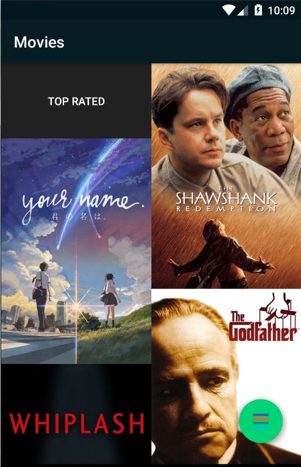
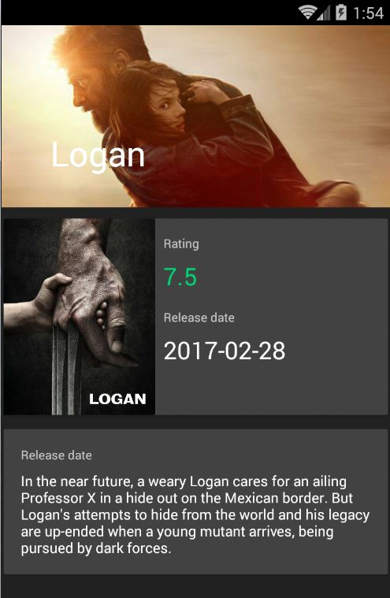
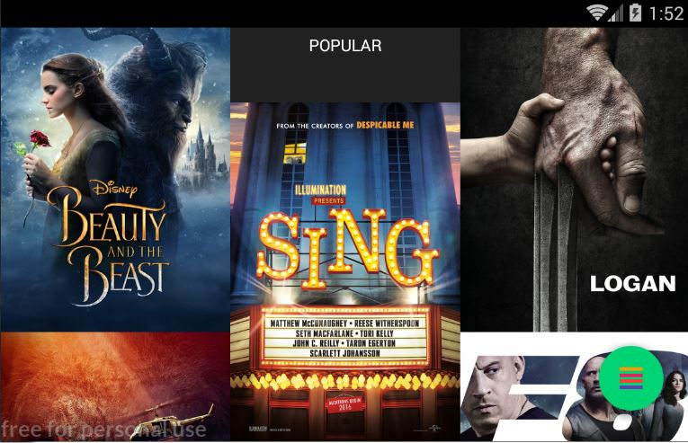
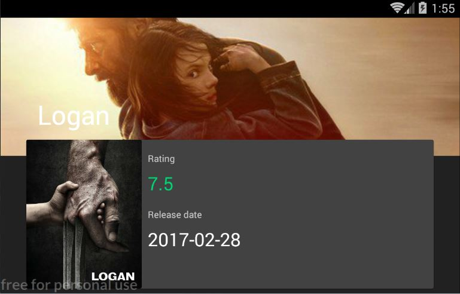
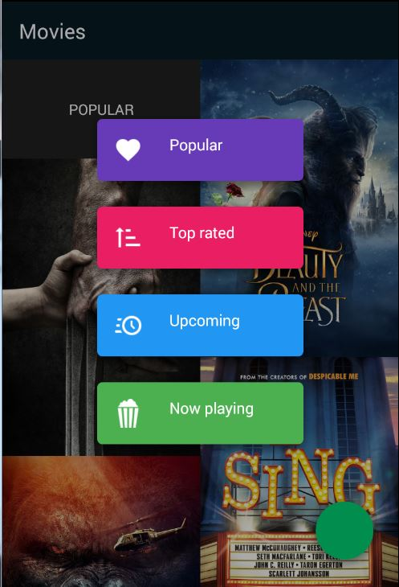

# Popular movies

Movie app created for fun. Real men need not architecture.

 | 

## Libraries and tools used in the project

* [BoomMenu](https://github.com/Nightonke/BoomMenu)
Just for fun
* [Fresco](https://github.com/facebook/fresco)
Image loading and rounding
* [Multiline Collapsingtoolbar](https://github.com/opacapp/multiline-collapsingtoolbar)
For long title in expanded toolbar

## License

    Copyright 2017 Nikita Rusin

    Licensed under the Apache License, Version 2.0 (the "License");
    you may not use this file except in compliance with the License.
    You may obtain a copy of the License at

        http://www.apache.org/licenses/LICENSE-2.0

    Unless required by applicable law or agreed to in writing, software
    distributed under the License is distributed on an "AS IS" BASIS,
    WITHOUT WARRANTIES OR CONDITIONS OF ANY KIND, either express or implied.
    See the License for the specific language governing permissions and
    limitations under the License.
